# Catalogue 30 truyện nam flagship — V1

Catalogue này là lớp tuyển chọn thượng nguồn. Mỗi mục là một concept package riêng gồm bản sắc, nhân vật, bối cảnh, opening hook, serial promise và bìa 3:4. Nó chưa phải StorySpec và không được inject vào Writer. Chỉ concept được human-gate chọn mới được materialize thành kernel riêng của truyện.

- Tổng số: 30
- Huyền huyễn: 7
- Tiên hiệp phi cổ điển: 5
- Đô thị, niên đại, nghề nghiệp và song xuyên: 18
- Trạng thái: concept_package_ready
- StorySpec đã materialize: 0
- Production mutation: không

## HX-01 — Những Quy Tắc Không Có Trong Sổ

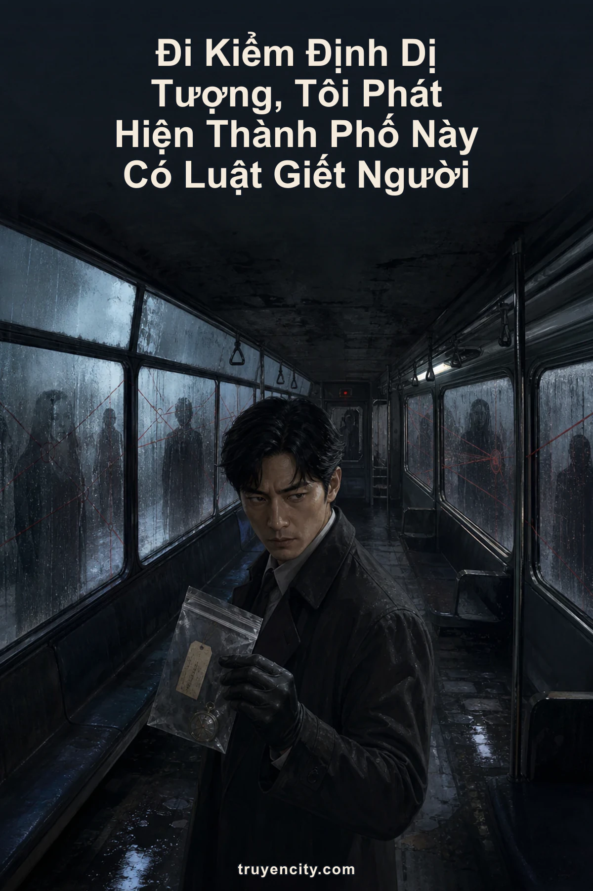

**Tagline:** Mỗi dị tượng đều có quy luật; cái giá nằm ở việc ai dám kiểm chứng trước.

**Mô tả:** Huyền huyễn điều tra thiên về trí mưu và khoái cảm giải mã. Main không biết sẵn đáp án, phải quan sát, thử sai và dùng vật chứng để giành quyền diễn giải từ một cơ quan vốn sống nhờ giữ bí mật. Mỗi thắng lợi đem lại uy tín lẫn một cách mới để thế giới phản công.

**Nhân vật chính:** Lâm Khải, nhân viên kiểm định bị xem là quá cẩn thận, giỏi thấy sai lệch nhỏ nhưng sợ đưa người khác vào thí nghiệm nguy hiểm.

**Bối cảnh:** Thành phố Vọng Hải hư cấu, nơi dị tượng được quản lý như sự cố công cộng và mỗi khu phố có lịch sử quy tắc khác nhau.

**Mở truyện:** Trong một toa tàu ngừng giữa đường hầm, Khải nhận ra hành khách biến mất không theo vị trí mà theo thứ tự họ nói dối, buộc anh tự nói ra bí mật đầu tiên để cứu người.

**Lời hứa dài kỳ:** Mỗi vụ việc mở một quy tắc, một thiết chế hưởng lợi và một thay đổi đời sống; hiểu biết cũ liên tục mất giá khi các quy tắc chồng lên nhau.

## HX-02 — Ca Trực Cuối Cùng Của Võ Sư

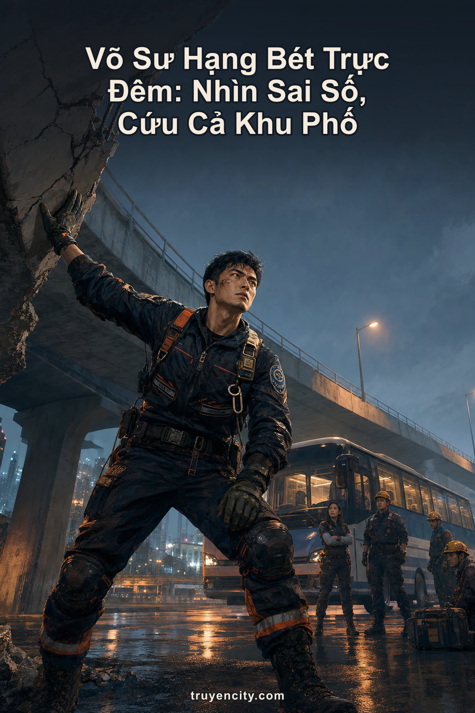

**Tagline:** Giấy phép cho anh quyền ra tay; mỗi cú đấm buộc anh chịu trách nhiệm lâu hơn.

**Mô tả:** Cao võ đô thị nhưng sức mạnh nằm trong nghề nghiệp, giấy phép và phối hợp. Công cụ của main chỉ đo phản hồi luyện tập, không tặng kỹ năng. Anh thắng sớm nhờ chuẩn bị đúng, rồi phải gánh hậu quả công khai của từng quyết định bảo hộ.

**Nhân vật chính:** Phan Duy, võ sư từng bỏ dở kỳ thi cấp phép, ít nói, đọc trận tốt nhưng có thói quen tự nhận mọi rủi ro.

**Bối cảnh:** Thành phố Lam Cảng, nơi khu dân cư thuê các đội võ sư được cấp phép để xử lý sinh vật năng lượng và sự cố công nghiệp.

**Mở truyện:** Trong ca trực bị coi là việc vặt, Duy phát hiện nhịp rung cầu vượt lệch với báo cáo và tự đổi đội hình trước khi một đoàn xe buýt lao vào vùng sụp.

**Lời hứa dài kỳ:** Mỗi nhiệm vụ đổi loại địa hình, quyền hạn và đồng đội; tiến bộ thể lực luôn đi cùng trách nhiệm pháp lý và xã hội nhìn thấy được.

## HX-03 — Trại Thú Sau Nhà

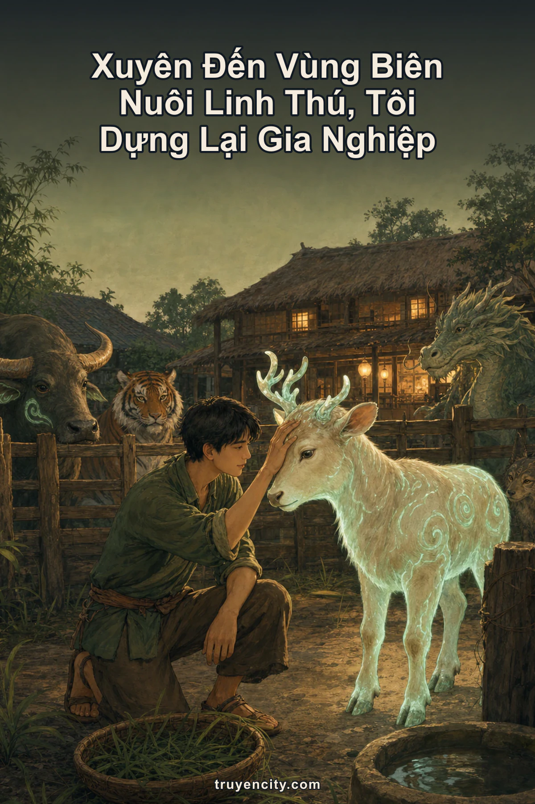

**Tagline:** Nuôi được một sinh vật mạnh không khó bằng khiến cả đàn tin mình.

**Mô tả:** Ngự thú theo hướng gia đình và tài sản sống. Kiến thức sinh học chỉ giúp main đặt giả thuyết; mỗi giống loài có phản ứng riêng, cần thời gian và nguồn thức ăn thật. Payoff đến từ đàn thú khỏe lên, mái nhà ổn hơn và cộng đồng học cách cùng bảo vệ nguồn sống.

**Nhân vật chính:** Trần Túc, kỹ thuật viên kiên nhẫn nhưng quen coi dữ liệu đáng tin hơn cảm xúc, phải học cách xin sự hợp tác của cả người lẫn thú.

**Bối cảnh:** Thung lũng Bạch Sam hư cấu với các trang trại nhỏ, đồng cỏ cộng đồng và những loài linh thú gắn với mùa.

**Mở truyện:** Túc tỉnh dậy đúng ngày con thú giống cuối cùng bỏ ăn; thay vì dùng thuốc quý, anh tháo chuồng và đi theo dấu chân nó tới nguồn nước đã bị đổi dòng.

**Lời hứa dài kỳ:** Các vòng nuôi dưỡng đổi từ bệnh, sinh sản, cộng sinh tới đất đai; mỗi tiến bộ của đàn thú tạo nghĩa vụ mới với gia đình và làng xóm.

## HX-04 — Thành Phố Xây Từ Tro Trắng

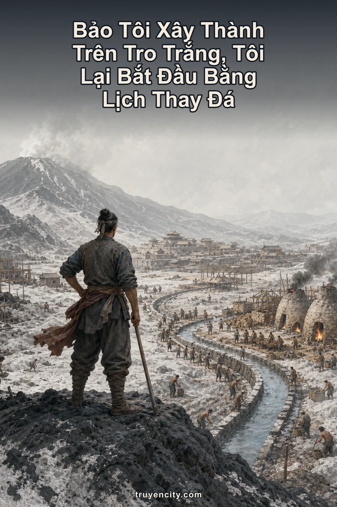

**Tagline:** Anh không được ban một vương quốc; anh phải thuyết phục từng người ở lại.

**Mô tả:** Huyền huyễn xây dựng văn minh với payoff đời sống cụ thể. Không có bảng xây dựng hay vật tư tự sinh. Mỗi công trình cần dân, vật liệu và tính chính danh; khi sản lượng tăng, tranh chấp phân phối và quyền lực cũng tăng theo.

**Nhân vật chính:** Đỗ Nghiêm, người giỏi tổ chức nhưng từng thất bại vì quyết quá nhanh, nay phải học cách chia quyền cho những người không tin mình.

**Bối cảnh:** Cao nguyên Tro Trắng sau đại tai biến, với đất nóng, mạch nước sâu và các đoàn người giữ nghề cũ nhưng không chung luật.

**Mở truyện:** Nghiêm từ chối dựng tường thành dù thú triều sắp đến; anh dùng ba ngày còn lại để đào một rãnh nước khiến cả thú lẫn người buộc phải đổi đường.

**Lời hứa dài kỳ:** Từ nước, gạch, lương thực tới xưởng và chợ, mỗi công trình thay đổi sinh kế lẫn cán cân quyền lực; thành phố chỉ lớn nếu dân tự nguyện ở lại.

## HX-05 — Xưởng Luyện Khí Cuối Hẻm

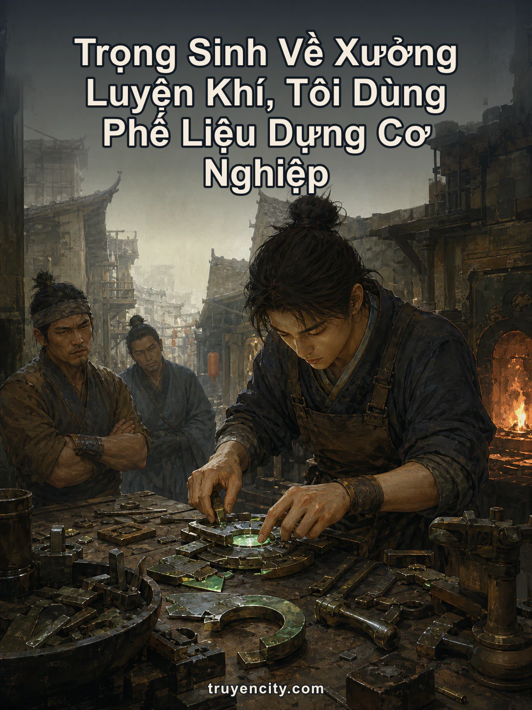

**Tagline:** Nhớ được nguyên lý không có nghĩa là làm đúng ngay lần đầu.

**Mô tả:** Khoái cảm chế tạo đi cùng kinh tế tài nguyên. Mỗi món đồ bắt đầu từ nhu cầu thật, vật liệu có sai số và phép thử có thể hỏng. Main không nhặt báu vật liên tục; anh xây tay nghề, dụng cụ xưởng và quan hệ với thợ lẫn khách hàng.

**Nhân vật chính:** Vũ Kha, thợ phụ trọng sinh mang mặc cảm về một tai nạn xưởng cũ, giỏi nguyên lý nhưng thiếu kiên nhẫn với người học chậm.

**Bối cảnh:** Khu thợ Bảy Lò của đô thành huyền huyễn, nơi nguyên liệu qua nhiều tầng độc quyền và sản phẩm phải chịu kiểm định công khai.

**Mở truyện:** Ngày đầu trở lại, Kha mua một thùng phế liệu không phải vì có bảo vật mà vì nhận ra ba loại hợp kim hỏng có thể ghép thành dụng cụ cứu ca làm đêm.

**Lời hứa dài kỳ:** Mỗi vòng chế tạo đổi nhu cầu, vật liệu và khách hàng; lợi thế ký ức giảm dần khi tiêu chuẩn tăng và người khác học theo.

## HX-06 — Ngày Đèn Thành Phố Tắt

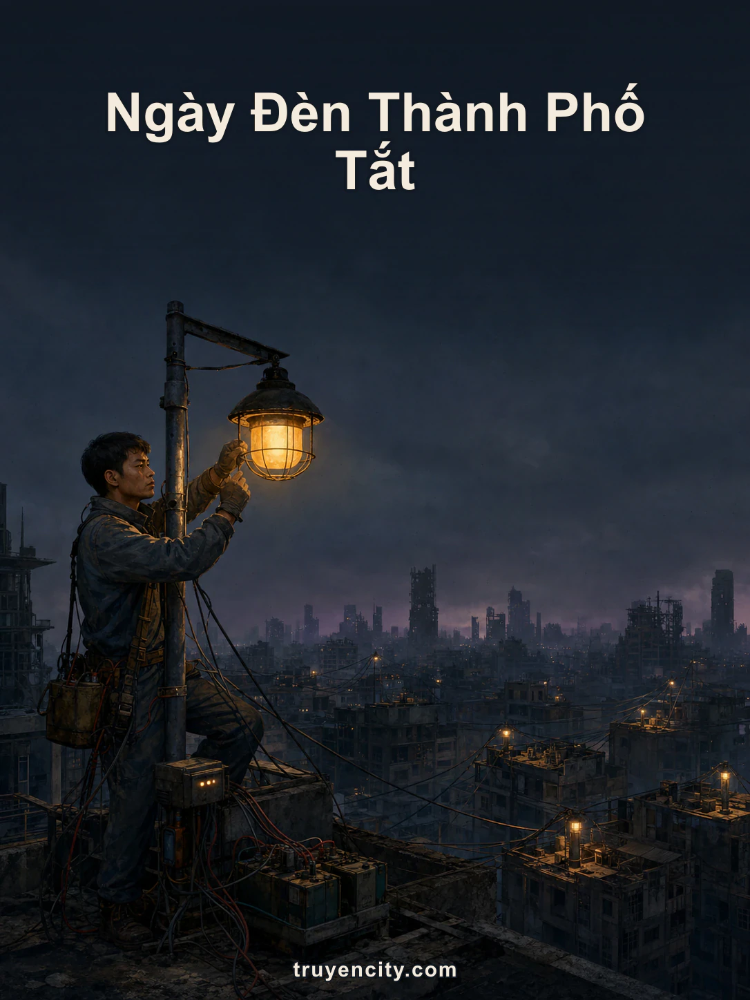

**Tagline:** Sống sót không chỉ là giết quái; đó là làm cho đèn sáng lại vào tối mai.

**Mô tả:** Mạt thế khoái hoạt theo hướng chủ động xây lại đời sống. Main có lợi thế sớm nhưng phải đo năng lượng, tiêu hao vật tư và dựa vào đội ngũ. Thành quả là ánh sáng, nước sạch, khu ở và người có thể quay lại làm việc.

**Nhân vật chính:** Ngô Phúc, kỹ thuật viên điện lực hay pha trò khi căng thẳng, biết sửa máy nhưng không quen lãnh đạo người khác.

**Bối cảnh:** Thành phố đa tầng sau cơn bão năng lượng, mỗi quận còn một loại hạ tầng và cộng đồng bảo vệ nguồn lực riêng.

**Mở truyện:** Đêm đầu mất điện, Phúc bỏ qua kho lương gần nhất để khởi động máy bơm tầng hầm trước khi nước nhiễm độc tràn vào khu trú ẩn.

**Lời hứa dài kỳ:** Mỗi vùng an toàn mới mở một chuỗi cung ứng, cộng đồng và bí mật môi trường; tiến bộ luôn hiện qua hạ tầng có thể sử dụng.

## HX-07 — Kẻ Phản Diện Tự Mua Đường Sống

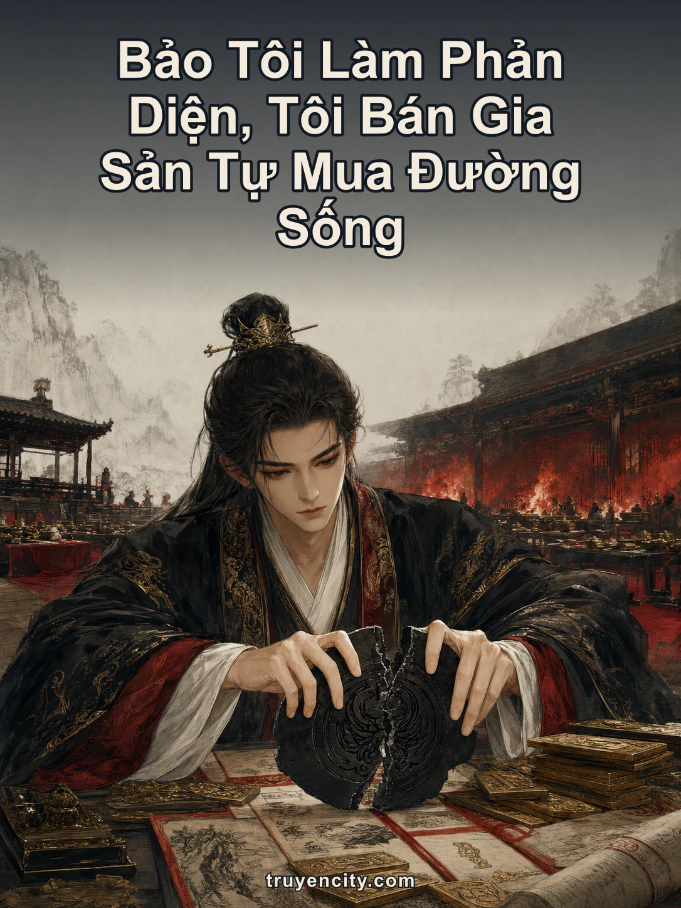

**Tagline:** Kịch bản cho hắn một cái chết; hắn trả giá để mua từng ngày tự do.

**Mô tả:** Phá mệnh theo hướng giao dịch và kiến thiết phe mới. Main chỉ nhớ các điểm chết lớn; sau lựa chọn đầu tiên, kịch bản mất độ tin cậy. Đối thủ không ngu và nhân vật nguyên tác có mục tiêu độc lập.

**Nhân vật chính:** Tạ Minh, thiếu chủ mang tiếng tàn nhẫn vì luôn làm đúng vai gia tộc giao, nay lần đầu phải tự chọn điều mình muốn bảo vệ.

**Bối cảnh:** Thế giới huyền huyễn nơi các đại tộc ký giao ước bằng tài nguyên và lời thề có hiệu lực vật chất.

**Mở truyện:** Thay vì dự tiệc nơi mình sẽ đắc tội thiên mệnh chi tử, Minh đem bán chiếc ấn thiếu chủ và dùng tiền chuộc những người sẽ chết cùng mình.

**Lời hứa dài kỳ:** Mỗi mốc thoát kịch bản làm thông tin cũ mất giá, buộc main xây tài sản, quan hệ và uy tín không dựa vào vai phản diện.

## TH-01 — Gia Phả Dưới Gốc Thanh Tùng

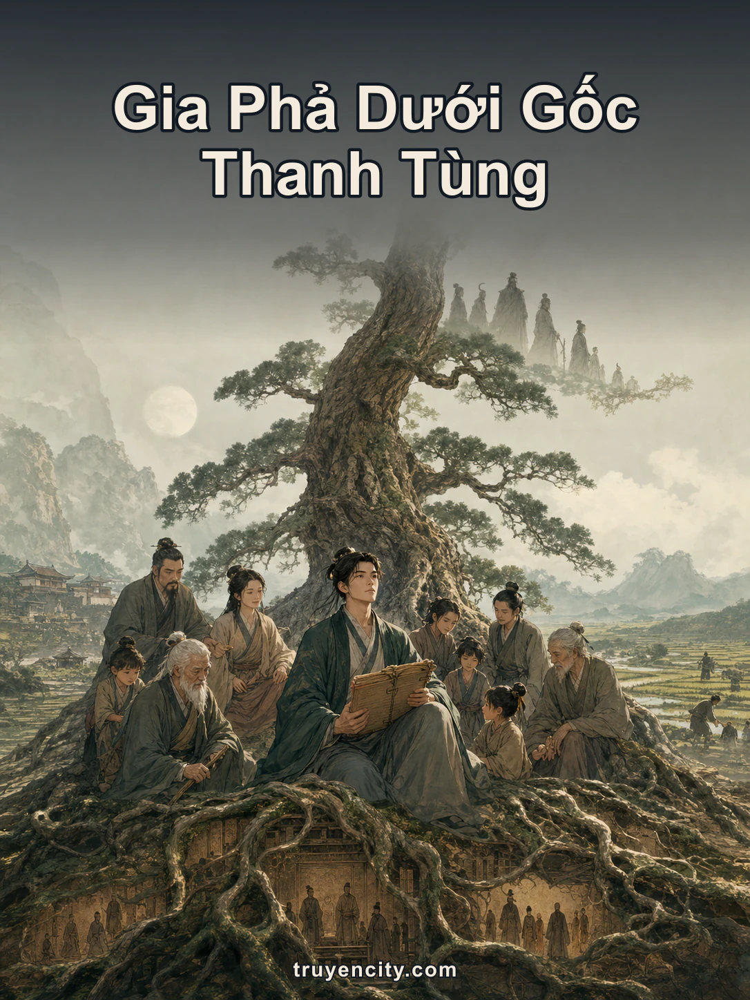

**Tagline:** Có những khoản đầu tư phải chờ đến đời cháu mới biết đúng hay sai.

**Mô tả:** Tiên hiệp gia tộc với ký ức dài và payoff có độ trễ. Mỗi thành viên có agenda, tuổi thọ và thước đo thành công riêng. Tài nguyên hôm nay có thể chỉ đời sau hưởng, còn sai lầm của tổ tiên không biến mất qua một lần nhảy thời gian.

**Nhân vật chính:** Lê Trường An, người sống sót cuối cùng của gia tộc trong kiếp trước, biết xu thế đại biến nhưng không nhớ ngày giờ hay kho tàng chính xác.

**Bối cảnh:** Gia tộc Thanh Tùng trấn giữ một linh điền cằn, nằm giữa các minh ước cũ và tuyến thương lộ đang đổi hướng.

**Mở truyện:** An trở lại đúng ngày gia tộc định bán mảnh đất xấu nhất; anh phản đối không vì có kho báu mà vì biết sáu năm nữa dòng nước sẽ đổi, rồi phải chứng minh bằng một vụ mùa nhỏ.

**Lời hứa dài kỳ:** Mỗi arc nối quyết định một thế hệ với hậu quả thế hệ sau; tiến bộ đến từ người, đất, nghề và minh ước ngoài cảnh giới.

## TH-02 — Tiên Môn Dạy Nghề

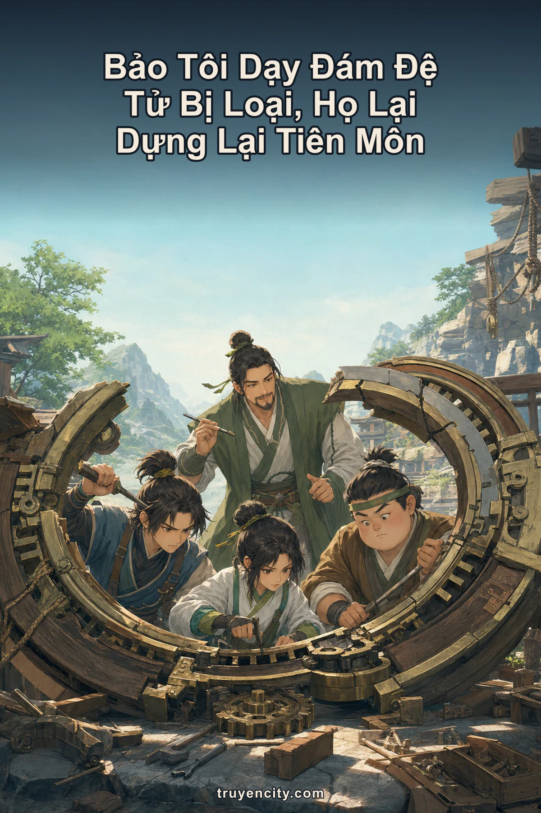

**Tagline:** Thu đồ dễ, dạy họ thành người không giống mình mới khó.

**Mô tả:** Tiên hiệp sư đồ pha vận hành tổ chức. Main không nhìn được thiên mệnh; học trò có ý chí và mục tiêu riêng. Payoff đến từ lúc người học tự vượt nút thắt, còn xung đột nảy sinh khi họ trưởng thành theo hướng thầy không kiểm soát.

**Nhân vật chính:** Đặng Mặc, tu sĩ từng là thợ sửa pháp khí, không giỏi diễn thuyết nhưng nhìn ra người khác học tốt nhất bằng cách nào.

**Bối cảnh:** Tiên môn Hạ Vân chỉ còn một xưởng hỏng, bảy học trò trái tính và khoản nợ danh dự với các môn phái nghề nghiệp.

**Mở truyện:** Trong ngày tuyển sinh cuối cùng, Mặc loại người có thiên phú cao nhất và nhận ba thí sinh bị chê vì anh phát hiện họ cùng sửa được một lỗi mà trưởng lão không thấy.

**Lời hứa dài kỳ:** Mỗi học trò mở một nghề, quan hệ và bài toán dạy khác; thành công của họ tăng uy tín môn phái đồng thời tạo quyền tự quyết mới.

## TH-03 — Phòng Thí Nghiệm Trên Đỉnh Mây

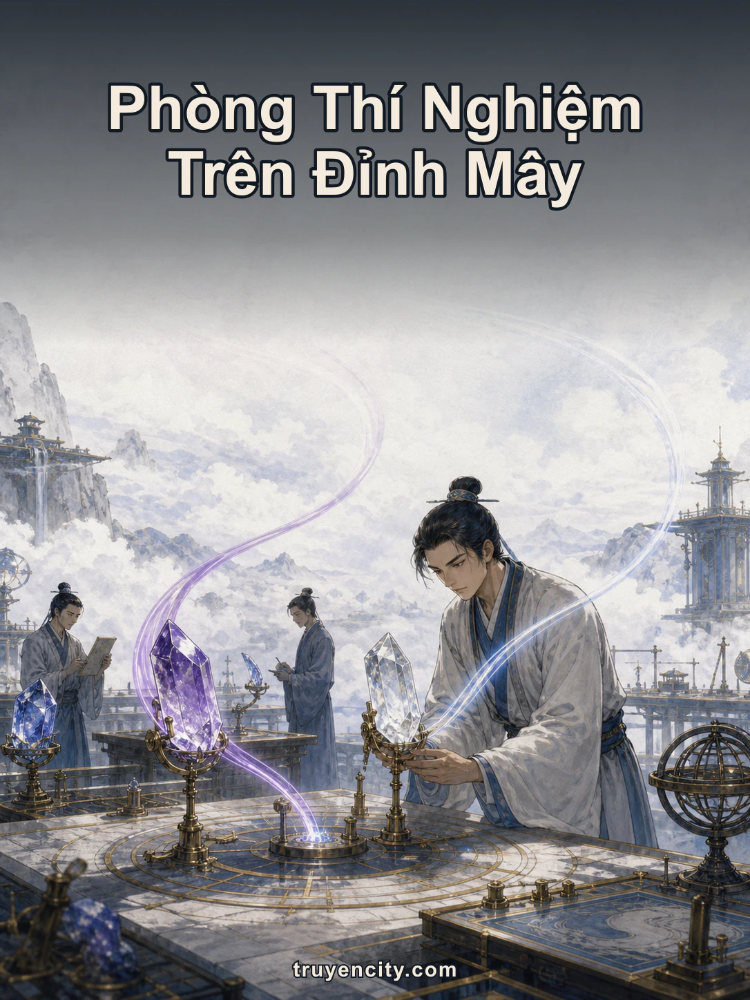

**Tagline:** Linh khí không đọc sách giáo khoa, và thí nghiệm sai vẫn phải có người trả giá.

**Mô tả:** Tu tiên nghiên cứu, nơi tri thức tạo cả sức mạnh lẫn xung đột thể chế. Main chỉ giỏi đặt câu hỏi; cần thiết bị, vật liệu, cộng sự và quyền công bố. Mỗi phát hiện mở một ứng dụng cùng một nguy cơ đạo đức.

**Nhân vật chính:** Mai Kính, nghiên cứu viên cứng đầu, quen tin số đo hơn địa vị nhưng phải học rằng dữ liệu linh khí cũng mang dấu vết người đo.

**Bối cảnh:** Học cung Thiên Đo trên đỉnh mây, chia quyền tiếp cận theo trường phái và kiểm soát các vùng linh khí bất ổn.

**Mở truyện:** Trong buổi kiểm tra nhập môn, Kính không giải bài mà chứng minh dụng cụ chuẩn của học cung cho kết quả khác nhau khi đổi người cầm, khiến cả phòng thi phải đóng cửa.

**Lời hứa dài kỳ:** Ba mươi chương liên tục đổi giả thuyết, sai số và người chịu tác động; tiến bộ hiện qua thiết bị, dữ liệu và quyền học thuật.

## TH-04 — Mỗi Đời Chỉ Mang Về Một Thứ

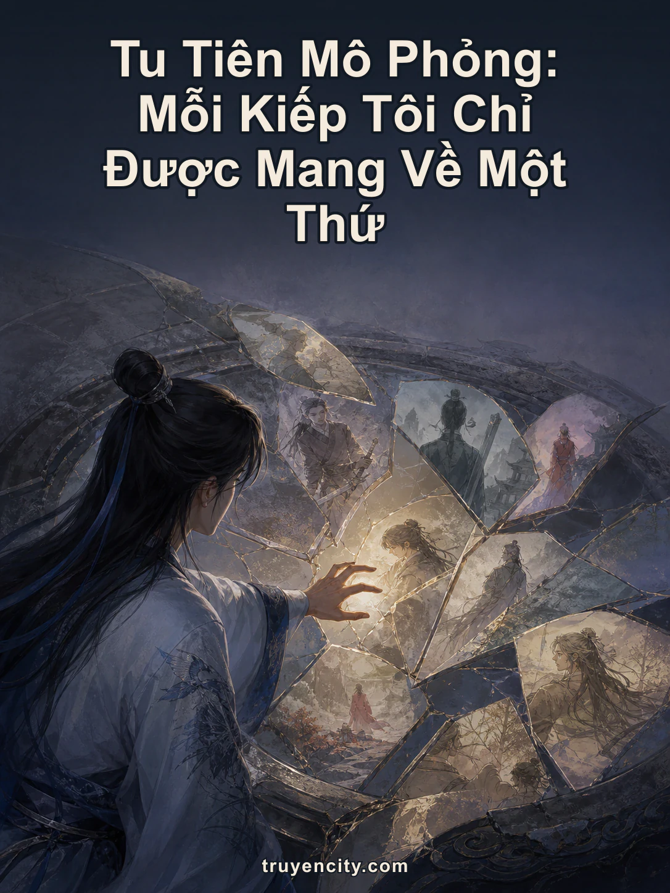

**Tagline:** Sống lại vô số lần, nhưng mỗi lần anh chỉ cứu được một ký ức.

**Mô tả:** Vòng lặp tu tiên không farm vô hạn. Mỗi đời là một chiến lược có mục tiêu và mất mát, còn hiện thực chỉ nhận một kết quả hữu hạn. Càng biết nhiều, main càng phải chọn điều gì đáng mang về.

**Nhân vật chính:** Chu Tinh, đệ tử sợ quên những người mình từng gặp trong mô phỏng, luôn ghi tên họ dù biết chỉ mình còn nhớ.

**Bối cảnh:** Tiên môn dùng một cổ kính cho đệ tử sống thử các nhánh lịch sử, nhưng chiếc kính lấy ký ức làm phí và không reset hoàn hảo.

**Mở truyện:** Sau vòng đời đầu tiên kéo dài bốn mươi năm, Tinh tỉnh lại ở tuổi mười bảy và bỏ lại tuyệt kỹ mạnh nhất để giữ tên của người sẽ cứu cả môn phái.

**Lời hứa dài kỳ:** Mỗi vòng đổi mục tiêu, quan hệ và lịch sử; quyết định giữ một thứ luôn đóng vĩnh viễn nhiều con đường khác.

## TH-05 — Y Quán Dưới Chân Núi

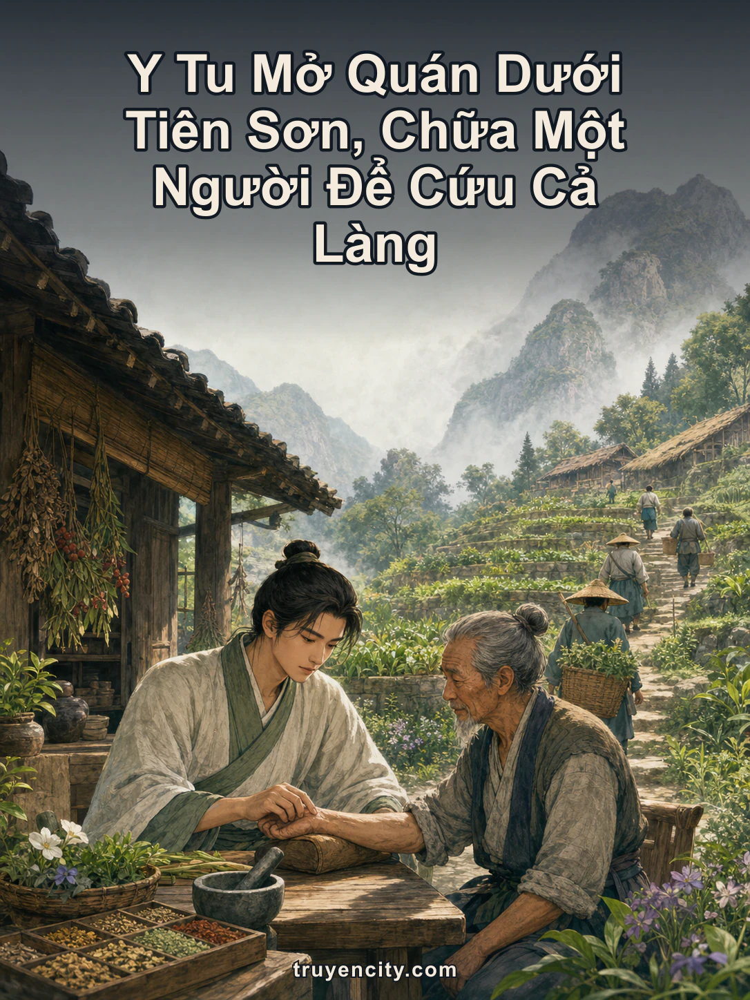

**Tagline:** Chữa một người là trả lại cho cả làng một phần sức sống.

**Mô tả:** Tiên hiệp chữa lành nhưng không cứu miễn phí. Chẩn đoán của main có phạm vi hẹp và tiêu hao sức lực; bệnh nhân có quyền từ chối. Mỗi ca chữa trị phục hồi một con người, một nghề và một mắt xích sinh kế.

**Nhân vật chính:** Hoàng Yên, y tu từng thất bại vì chỉ nhìn bệnh không nhìn người, nay đặt nguyên tắc không chữa nếu bệnh nhân chưa hiểu cái giá.

**Bối cảnh:** Làng Dược Khê dưới chân tiên sơn, thiếu người lao động, đất thuốc bỏ hoang và bị thương lái ép giá theo mùa.

**Mở truyện:** Bệnh nhân đầu tiên không phải người sắp chết mà là bà chủ cối xay mất cảm giác ở tay; chữa bà đồng nghĩa cả làng có bột trước mùa mưa.

**Lời hứa dài kỳ:** Ca bệnh, dược điền và sinh kế nối nhau; uy tín tăng kéo theo chuẩn mực, dịch bệnh và lựa chọn phân phối dược liệu khó hơn.

## DT-01 — Trở Lại Mùa Cá Nổi

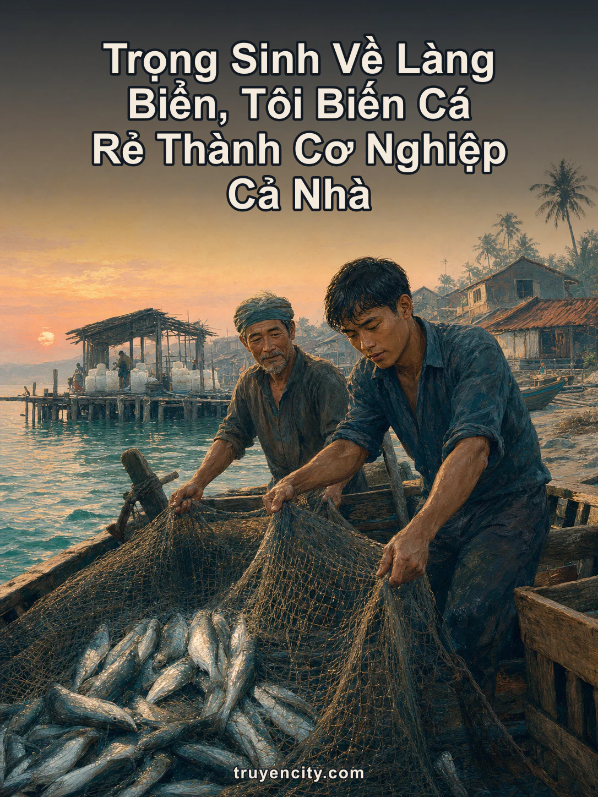

**Tagline:** Anh nhớ mùa biển đổi, nhưng mẻ cá đầu tiên vẫn phải tự tay kéo lên.

**Mô tả:** Niên đại làng biển khoái hoạt, main chủ động từ chương đầu và có thành quả vật chất trước chương ba. Ký ức chỉ cho xu hướng, không cho tọa độ hay giá chính xác; mỗi đồng tiền phải đi qua lao động, hao hụt và đầu ra thật.

**Nhân vật chính:** Nguyễn Hải Sơn, người từng bỏ quê đi làm thuê, trở lại tuổi hai mươi tám với mong muốn duy nhất là để cha mẹ không phải bán chiếc thuyền cuối cùng.

**Bối cảnh:** Làng biển Vạn Gió hư cấu cuối thập niên 1980, với bến cá nhỏ, xưởng đá cây và chợ huyện cách một chuyến xe đêm.

**Mở truyện:** Sơn thức dậy trong ngày cả làng bỏ một luồng cá nhỏ vì giá rẻ; anh không lao ra khơi xa mà gom người làm mẻ cá khô thử ngay trước cơn mưa trái mùa.

**Lời hứa dài kỳ:** Đánh bắt, chế biến và phân phối thay nhau tạo payoff; lợi thế ký ức giảm khi thị trường học theo và nguồn lợi biển cần được bảo vệ.

## DT-02 — Mùa Rừng Trả Lộc

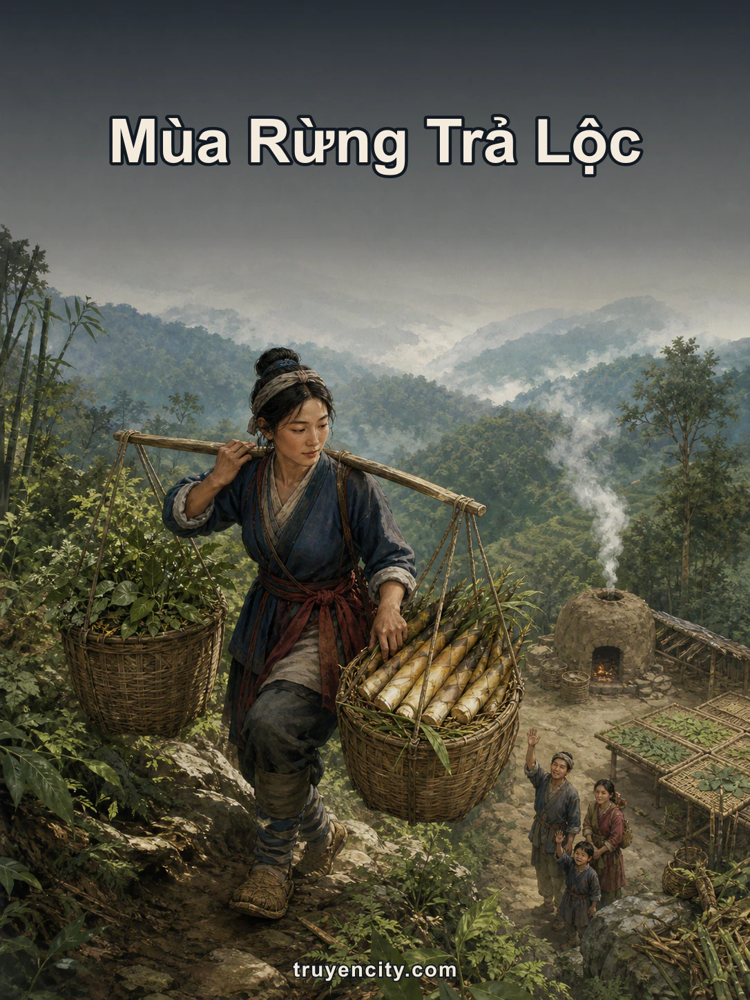

**Tagline:** Biết lấy gì từ rừng chưa đủ; phải biết để lại gì cho mùa sau.

**Mô tả:** Niên đại miền núi thiên về sinh kế và đời sống ấm. Main biết kỹ thuật chứ không biết kho báu hay vị trí con mồi. Payoff là dụng cụ tốt hơn, bếp đủ ăn và nguồn hàng tái sinh, không phải săn giết vô hạn.

**Nhân vật chính:** Bùi Văn Lộc, người từng mất em trai trong một chuyến khai thác liều lĩnh, trở về quyết làm giàu mà không trả giá bằng mạng người hay cánh rừng.

**Bối cảnh:** Bản Khe Mây hư cấu với rừng tre, dược liệu theo mùa, đường chợ khó đi và quyền khai thác dựa trên thỏa thuận cộng đồng.

**Mở truyện:** Lộc ngăn nhóm thanh niên đuổi theo đàn thú và dẫn họ tới một vùng măng trái vụ; muốn bán được, anh phải tự chế lò sấy trước khi đường núi bị mưa cắt.

**Lời hứa dài kỳ:** Mỗi mùa đổi sản vật, cách sơ chế và quyền khai thác; tiến bộ vật chất luôn gắn với việc giữ nguồn hàng sống qua năm sau.

## DT-03 — Xưởng Nhỏ Năm 1989

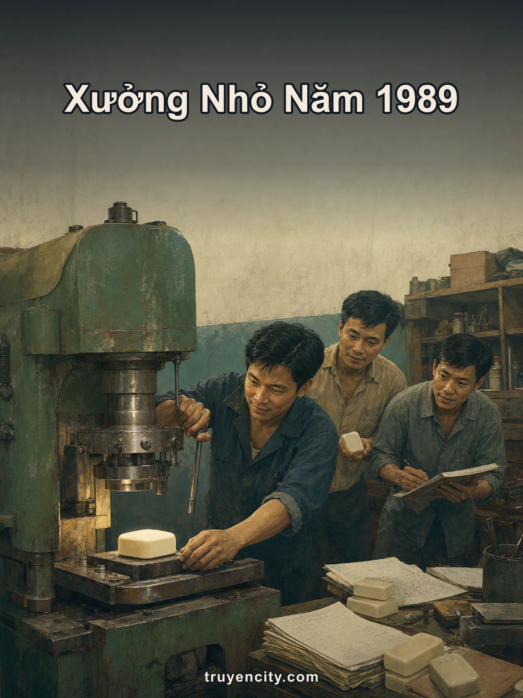

**Tagline:** Anh nhớ thị trường sẽ cần gì; chiếc máy cũ vẫn bắt anh làm lại từ đầu.

**Mô tả:** Niên đại công nghiệp lấy logic kỹ thuật, vốn lưu động, đội ngũ và phân phối làm causal engine. Main thắng nhờ chọn đúng nhu cầu và thử nhỏ, nhưng sai số sản xuất cùng công nợ có thể giết xưởng dù hàng bán được.

**Nhân vật chính:** Trương Hữu Thành, kỹ thuật viên từng chứng kiến xưởng gia đình phá sản, nhớ nguyên lý và nhu cầu nhưng không nhớ thông số hoàn chỉnh.

**Bối cảnh:** Thị xã Tân Phú hư cấu năm 1989, nơi xưởng cơ khí tập thể tan rã, máy cũ được bán lại và mạng đại lý tư nhân vừa hình thành.

**Mở truyện:** Thành dùng toàn bộ tiền cưới để mua chiếc máy ép bị coi là phế liệu, rồi phải làm ra một lô mẫu bán được trong bảy ngày trước khi gia đình buộc anh trả lại.

**Lời hứa dài kỳ:** Từ mẫu thử tới quy trình, máy móc và hợp đồng phân phối; ký ức tương lai giảm giá trị khi đối thủ học và tiêu chuẩn thị trường tăng.

## DT-04 — Bếp Nhà Qua Bốn Mùa

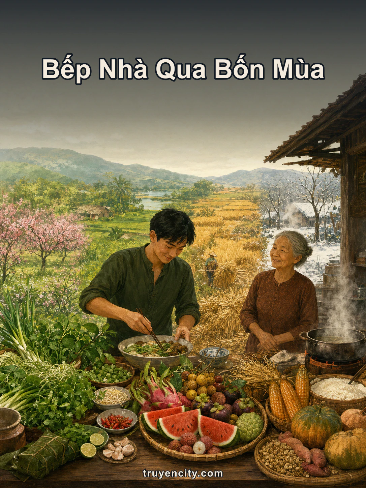

**Tagline:** Một bữa ngon không đổi đời ngay, nhưng bốn mùa có thể dựng lại một mái nhà.

**Mô tả:** Hưu nhàn nhưng không đứng yên. Mỗi mùa có nguyên liệu, sức lao động và nhu cầu khách khác nhau; món ăn là payoff cảm xúc đồng thời tạo tiền, dụng cụ và sinh hoạt cộng đồng mới.

**Nhân vật chính:** Lê Nam, đầu bếp kiệt sức sau nhiều năm ở thành phố, tay nghề vững nhưng phải học lại nhịp sống và lòng tự trọng của mẹ.

**Bối cảnh:** Làng Bình An hư cấu với vườn cây, chợ phiên và căn bếp cũ nhìn ra cánh đồng thay màu bốn mùa.

**Mở truyện:** Ngày về quê, Nam không mở quán mà nấu hết mẻ cà chua sắp hỏng của mẹ thành sốt đóng chai, đem đổi lấy mái ngói trước cơn mưa.

**Lời hứa dài kỳ:** Mùa vụ, món ăn, khách quen và không gian nhà cùng tiến triển; đời sống ấm áp luôn để lại thay đổi vật chất hoặc quan hệ.

## DT-05 — Chuyến Hàng Qua Cánh Cổng Mưa

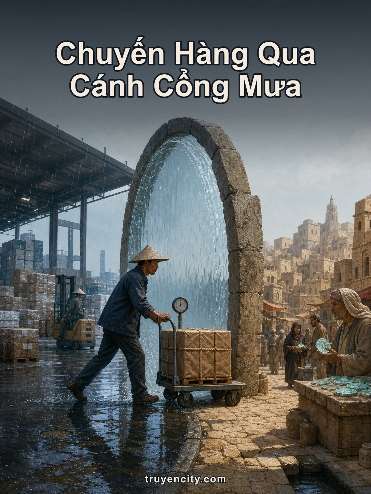

**Tagline:** Hai thế giới không thiếu đồ; chúng thiếu người hiểu thứ gì thật sự có giá trị.

**Mô tả:** Song xuyên kinh doanh với logistics, nguồn hàng và phản ứng thị trường thật. Không gian không vô hạn, hàng không tự sinh và đối tác hai bên có mục tiêu riêng. Tiến bộ đi từ món hàng sang hạn mức, kho vận và tín nhiệm.

**Nhân vật chính:** Đinh Quân, chủ kho đang nợ, giỏi ghép nhu cầu với hàng hóa nhưng có thói quen giấu nguồn để giữ quyền kiểm soát.

**Bối cảnh:** Một bên là thành phố Việt hư cấu có mạng bán buôn; bên kia là đô thị đá sống nhờ hệ thống thu nước và những hợp đồng khắc trên vật liệu.

**Mở truyện:** Trong cơn mưa đầu mùa, Quân đưa nhầm một thùng ống lọc nước qua cổng và phát hiện nó có giá hơn vàng, nhưng chỉ còn mười bảy phút để tìm cách đổi hàng có thể mang về hợp pháp.

**Lời hứa dài kỳ:** Mỗi giao dịch làm giá, luật và quyền lực hai bên đổi; cổng hữu hạn buộc main chọn quan hệ dài hạn thay vì vét báu vật.

## DT-06 — Phòng Thu Không Có Bài Hit

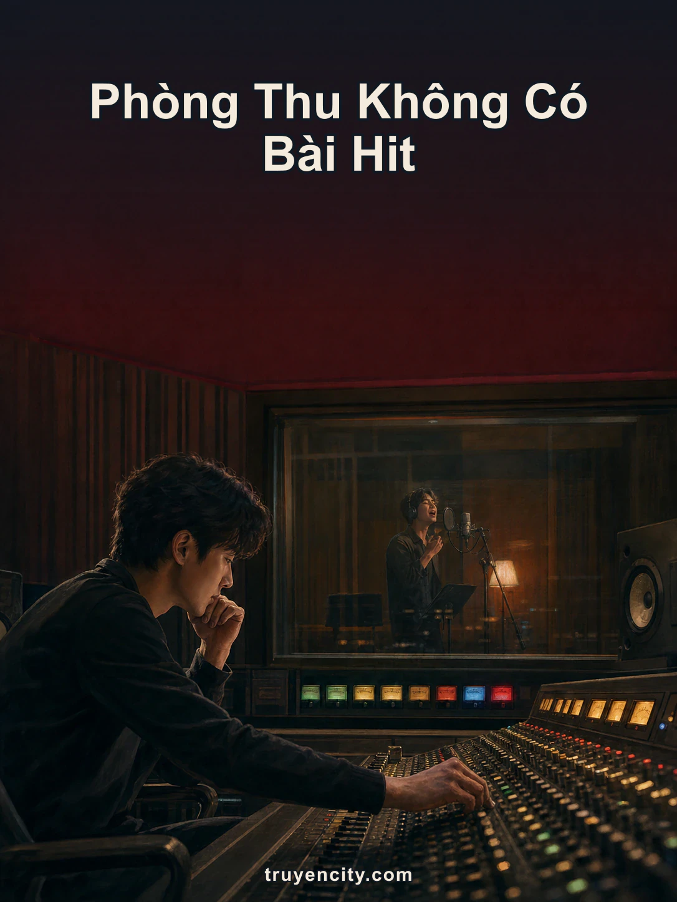

**Tagline:** Anh mang theo cách làm nghề, không mang theo một kho kiệt tác để chép lại.

**Mô tả:** Truyện giải trí thiên về quá trình sáng tạo và phản hồi phân hóa. Main có thẩm mỹ lẫn kinh nghiệm nhưng không nhớ nguyên văn bài hát, phim hay thuật toán. Mỗi dự án nâng kỹ năng, khán giả và quyền sản xuất cùng trách nhiệm.

**Nhân vật chính:** Đào Khánh, nhà sản xuất từng đốt cháy đội ngũ vì ám ảnh thành công, nay phải làm lại với một ca sĩ có giọng tốt nhưng không muốn thành ngôi sao.

**Bối cảnh:** Đô thị giải trí hư cấu nơi nền tảng phát hành minh bạch dữ liệu thử nghiệm nhưng quyền tác giả được chia rất chặt.

**Mở truyện:** Khánh được giao cứu một buổi diễn thất bại trong hai ngày; anh không viết hit mà cắt sân khấu xuống còn một căn phòng và để khán giả quyết định phần cuối.

**Lời hứa dài kỳ:** Từng sản phẩm đổi định dạng, công chúng và quan hệ sáng tạo; thành công không đồng thanh và luôn mở dự án khó hơn.

## DT-07 — Lần Này Ba Sẽ Về Sớm

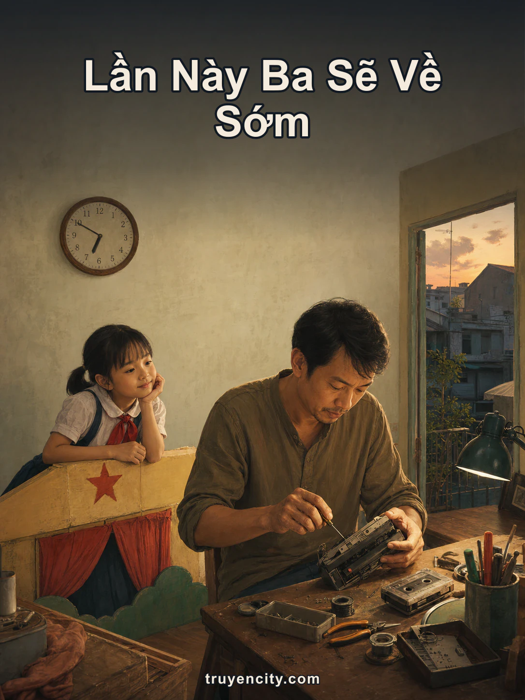

**Tagline:** Anh nhớ những tiếc nuối lớn, nhưng phải học lại con mình từ đầu.

**Mô tả:** Nãi ba nam tần nhưng cả trẻ và người thân đều có nhu cầu, ranh giới riêng. Main không biết trước mọi bệnh hay cảm xúc. Payoff đến từ hành động chăm sóc cụ thể, lòng tin được xây lại và năng lực nghề nghiệp phù hợp đời sống mới.

**Nhân vật chính:** Phạm Minh, người cha từng thành công quá muộn, vụng lời nhưng nhớ rõ những ngày mình đã vắng mặt và quyết không dùng quà cáp thay cho hiện diện.

**Bối cảnh:** Khu tập thể ven đô hư cấu, nơi Minh vừa chăm con vừa nhận sửa đồ gia dụng để kiếm tiền tại nhà.

**Mở truyện:** Ngày đầu trở lại, Minh bỏ cuộc họp quyết định thăng chức để đến buổi biểu diễn của con, rồi phát hiện chính chiếc máy âm thanh hỏng cho anh cơ hội kiếm đơn hàng đầu tiên.

**Lời hứa dài kỳ:** Mỗi vòng chăm sóc gắn với một bước nghề nghiệp và nếp nhà; tiến bộ đo bằng lòng tin của con, thời gian thật và căn nhà tốt lên.

## DT-08 — Sổ Nợ Phố Cũ

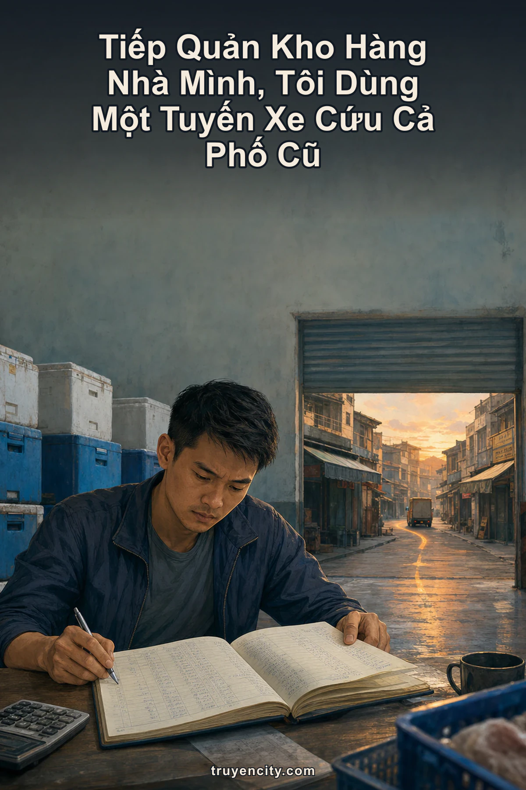

**Tagline:** Cứu một cửa hàng không khó bằng khiến những người giữ nó chịu chia quyền.

**Mô tả:** Đô thị nghề nghiệp thực tế, nơi khách hàng, hợp đồng, hàng hóa và quyền truy cập đều có chủ. Main không biết ý định đối tác hay kết quả thị trường; mỗi thắng lợi tạo thêm nghĩa vụ kinh tế và buộc anh học cách tin đội ngũ.

**Nhân vật chính:** Nguyễn An Bình, chủ kho đời thứ hai giỏi đọc dòng tiền nhưng luôn giữ số liệu vì sợ mất tài sản cuối cùng của gia đình.

**Bối cảnh:** Phố buôn hư cấu với kho lạnh nhỏ, nhóm tiểu thương lâu năm và mạng giao hàng đang bị thay đổi bởi quy mô mới.

**Mở truyện:** Bình phát hiện kho không mất tiền vì trộm mà vì lịch xe khiến hàng chết chậm; anh cược khoản cọc cuối cùng vào một tuyến giao thử có thể chứng minh điều đó trong đêm.

**Lời hứa dài kỳ:** Mỗi nút thắt vận hành đổi quyền, dữ liệu và quan hệ; tiến bộ hiện qua dòng tiền, tài sản và quyền quyết định được chia đúng.

## DT-09 — Vai Phản Diện Xin Nghỉ Việc

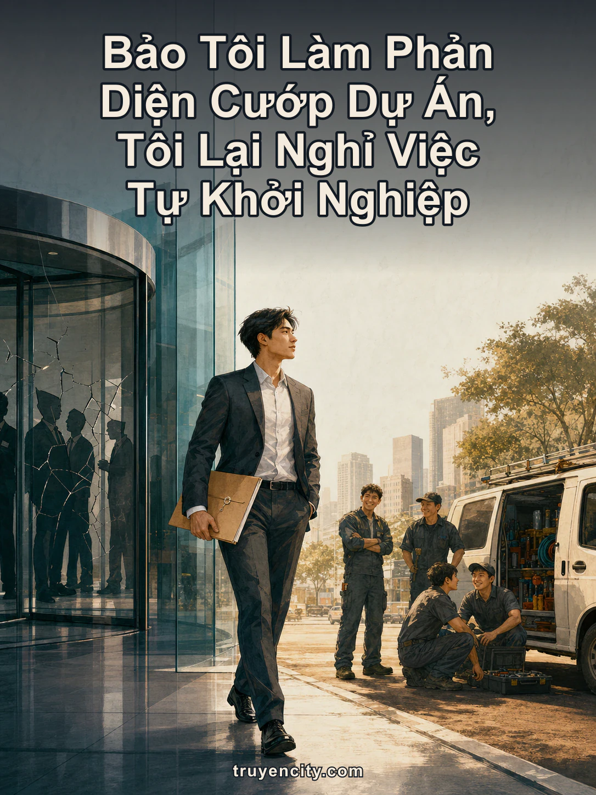

**Tagline:** Biết mình sẽ bị hạ bệ, anh quyết không diễn tiếp cảnh mà người khác đã viết.

**Mô tả:** Phá kịch bản đô thị không dựa vào bí mật tác giả để vả mặt. Sau mỗi can thiệp, người khác phản ứng độc lập và tuyến sự kiện đổi thật. Main phải xây tài sản, nghề và quan hệ mới thay vì chỉ né tai họa cũ.

**Nhân vật chính:** Võ Khải, người thừa kế bị dạy rằng kiểm soát là yêu thương, biết các mốc sụp đổ lớn nhưng không hiểu động cơ thật của những người quanh mình.

**Bối cảnh:** Đô thị thương mại hư cấu nơi các gia đình lớn sở hữu chuỗi dịch vụ nhưng mọi giao dịch rời hệ thống đều để lại bằng chứng.

**Mở truyện:** Ngay trước cuộc họp nơi anh sẽ cướp dự án của “nam chính”, Khải nộp đơn nghỉ việc và dùng tiền cá nhân mua lại đội bảo trì nhỏ sắp bị giải tán.

**Lời hứa dài kỳ:** Mỗi bước thoát vai làm kịch bản cũ mất giá; tự do tăng cùng trách nhiệm với đội ngũ và những người bị lựa chọn mới tác động.

## DT-10 — Bang Hội Không Đánh Boss

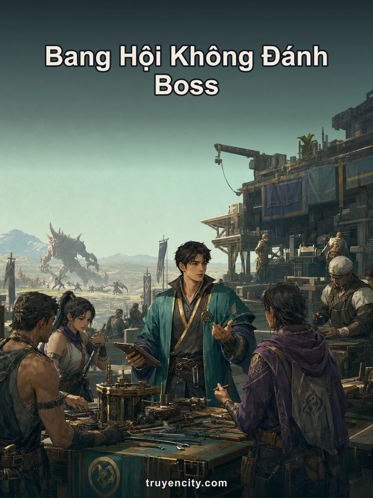

**Tagline:** Họ không mạnh nhất máy chủ; họ khiến cả máy chủ cần đến mình.

**Mô tả:** Võng du kinh tế cộng đồng. Bảng dữ liệu không dự báo giá hoặc hành động người chơi; nhà phát hành, bang hội khác và khách hàng đều phản ứng theo lợi ích. Payoff đến từ đội nhóm, niềm tin và quyền thị trường.

**Nhân vật chính:** Đỗ Vinh, cựu đội trưởng raid mệt mỏi vì tranh hạng, giỏi tổ chức người khác nhưng phải học cách không biến đồng đội thành nhân lực miễn phí.

**Bối cảnh:** Game thực tế ảo hư cấu có kinh tế vật phẩm khan hiếm, nghề dịch vụ và luật can thiệp thị trường minh bạch.

**Mở truyện:** Trong ngày mở máy chủ, Vinh bỏ qua cuộc đua boss đầu tiên để lập trạm sửa trang bị miễn phí có giới hạn, thu về thứ quý hơn vàng: dữ liệu nhu cầu thật.

**Lời hứa dài kỳ:** Dịch vụ, đội ngũ và thị trường thay nhau tiến triển; mỗi thành công khiến người chơi lẫn nhà phát hành học và phản ứng.

## DT-11 — Vết Men Dưới Lớp Bụi

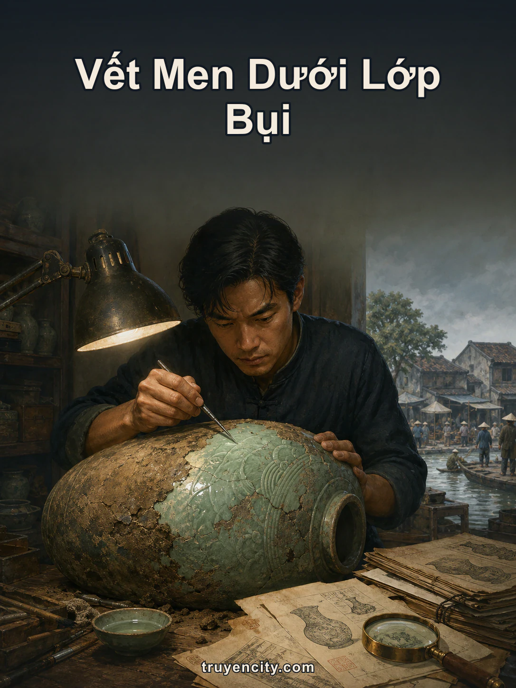

**Tagline:** Giá trị thật không phát sáng; nó để lại dấu vết cho người đủ kiên nhẫn.

**Mô tả:** Giám bảo nghề nghiệp không dùng mắt thần toàn năng. Mỗi vật phẩm có lịch sử sở hữu, chi phí phục hồi và rủi ro pháp lý. Tiến bộ đi từ vốn quay vòng tới uy tín và quyền tiếp cận nguồn hàng đáng tin.

**Nhân vật chính:** Trịnh Duy, thợ phục hồi từng định giá sai món đồ của gia đình, thận trọng với giá tiền nhưng bị hấp dẫn bởi những lịch sử còn thiếu đoạn.

**Bối cảnh:** Khu chợ đồ cũ ven sông của một thành phố Việt hư cấu, nơi xưởng phục hồi, nhà sưu tầm và gia đình bán đồ đều có chuẩn mực riêng.

**Mở truyện:** Duy chạm vào chiếc bình bị nứt và công cụ chỉ báo “men mới hơn thân”; anh mua không phải vì quý mà vì nghi có hai món đồ bị ghép để che một câu chuyện thất lạc.

**Lời hứa dài kỳ:** Mỗi món đồ mở một vụ kiểm chứng, quan hệ và bài toán vốn; uy tín có thể mất nếu main vội kết luận hoặc giấu nguồn gốc.

## DT-12 — Hiệp Hai Mới Bắt Đầu

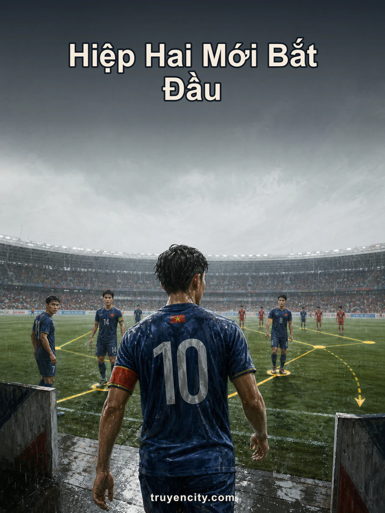

**Tagline:** Đọc được trận đấu chỉ cho anh một cơ hội; đôi chân phải tự chạy đến phút cuối.

**Mô tả:** Thể thao đường dài với tiến bộ nhìn thấy qua bài tập, vai trò và cách đội vận hành. Main không được hệ thống tăng chỉ số; chấn thương, lịch thi đấu và cạnh tranh vị trí đều có hậu quả kéo dài.

**Nhân vật chính:** Nguyễn Tấn, tiền vệ thông minh nhưng thể lực trung bình, quen sửa lỗi người khác và phải học cách để đồng đội tự quyết trong sân.

**Bối cảnh:** Giải bóng đá chuyên nghiệp hư cấu với câu lạc bộ tỉnh nhỏ, học viện trẻ và lịch thi đấu khắc nghiệt.

**Mở truyện:** Bị đẩy lên ghế dự bị trong trận khai mùa, Tấn nhận ra đối thủ hụt nhịp sau phút sáu mươi và xin vào sân với một phương án chỉ có tác dụng nếu cả đội tin anh.

**Lời hứa dài kỳ:** Từng cửa sổ trận đấu đổi điểm yếu, bài tập và vai trò; thành công của main được đo bằng đội mạnh lên và cơ thể còn đi được đường dài.

## DT-13 — Ca Trực Không Có Phép Màu

**Tagline:** Bác sĩ giỏi không biết hết; anh biết lúc nào phải hỏi thêm một người.

**Mô tả:** Y nghiệp có domain truth và giới hạn thẩm quyền. Ca bệnh tạo căng thẳng từ thông tin thiếu, thời gian và nguồn lực, không cần đồng nghiệp ngu để bị vả mặt. Payoff gồm kết quả điều trị, lòng tin và năng lực đội ngũ.

**Nhân vật chính:** Bác sĩ Lê Minh Khoa, bình tĩnh khi cấp cứu nhưng hay tự gánh quyết định, phải học rằng hội chẩn đúng lúc cũng là một loại năng lực.

**Bối cảnh:** Bệnh viện đa khoa hư cấu phục vụ cả thành phố và vùng ven, với quy trình, nguồn lực và đội ngũ có giới hạn thật.

**Mở truyện:** Trong ca trực đầu, Khoa từ chối chẩn đoán hiếm được mọi người mong đợi và quay lại hỏi một câu đơn giản về bữa ăn, mở ra hướng xử lý kịp thời nhưng cần bệnh nhân đồng ý.

**Lời hứa dài kỳ:** Ca bệnh thay đổi chuyên khoa, thông tin và quan hệ; sau ba mươi chương, cả khoa phải làm việc tốt hơn chứ không chỉ danh tiếng main tăng.

## DT-14 — Thành Phố Cần Một Dòng Nước

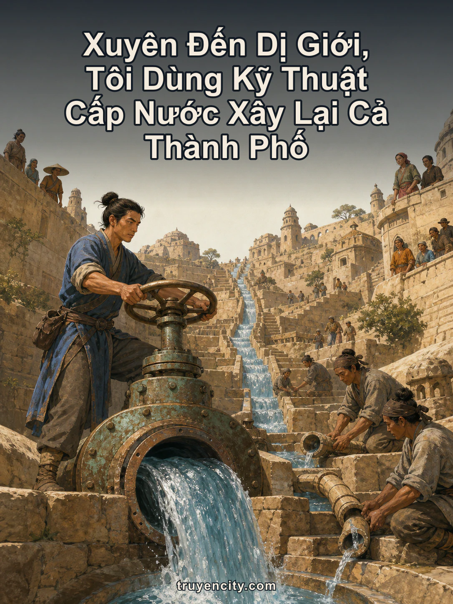

**Tagline:** Anh không mang theo máy móc hiện đại; chỉ mang theo cách tìm đúng nút thắt.

**Mô tả:** Kỹ nghệ thế giới mới nhưng không phát minh thần tốc. Main nhớ nguyên lý, thiếu bản vẽ và tiêu chuẩn; mọi giải pháp phải đo, thử, bảo trì. Payoff cộng đồng hiện qua nước sạch, đường đi và công xưởng vận hành được.

**Nhân vật chính:** Kỹ sư Trần Dương, giỏi tìm nút thắt hệ thống nhưng từng bỏ qua người dùng cuối, nay phải thương lượng với những cộng đồng không tin công trình của người lạ.

**Bối cảnh:** Thành phố bậc thang hư cấu xây quanh vực khô, dùng máy nước cổ và vật liệu có tính chất khác Trái Đất.

**Mở truyện:** Dương được yêu cầu sửa cỗ máy nước trung tâm nhưng phát hiện nó hoạt động đúng; vấn đề nằm ở cách ba khu dân cư khóa van để tự bảo vệ mình.

**Lời hứa dài kỳ:** Mỗi hạ tầng đổi vật liệu, người hưởng lợi và chi phí bảo trì; tiến bộ kỹ thuật luôn tạo bài toán phân phối mới.

## DT-15 — Đường Dài Có Biên Nhận

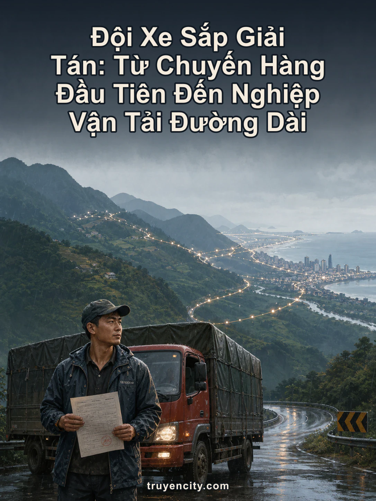

**Tagline:** Giao đúng hẹn là lời hứa; giữ được người đi cùng mới là sự nghiệp.

**Mô tả:** Logistics hiện thực, mỗi đơn hàng có nguồn, lịch, chi phí nhiên liệu và bằng chứng giao. Main không biết trước tai nạn hay khách hàng; anh thắng nhờ ghép đúng xe, người và tuyến rồi tái đầu tư có kiểm soát.

**Nhân vật chính:** Lương Quốc, điều phối viên từng mất đội vì ép lịch, nay quyết xây doanh nghiệp nơi tài xế có quyền từ chối tuyến không an toàn.

**Bối cảnh:** Mạng đường Việt hư cấu nối cao nguyên, đồng bằng và cảng, với thời tiết cùng nhu cầu bảo quản khác nhau.

**Mở truyện:** Đơn hàng đầu tiên có thể cứu đội xe lại không vừa bất kỳ thùng nào; Quốc phải chia chuyến và thuyết phục hai khách đối nghịch cùng chia một tuyến.

**Lời hứa dài kỳ:** Tuyến đường, hàng hóa, thời tiết và đội ngũ liên tục đổi; tiến bộ hiện qua xe, dữ liệu và hợp đồng dài hạn có thể mất.

## DT-16 — Quán Nhỏ Đợi Mùa Về

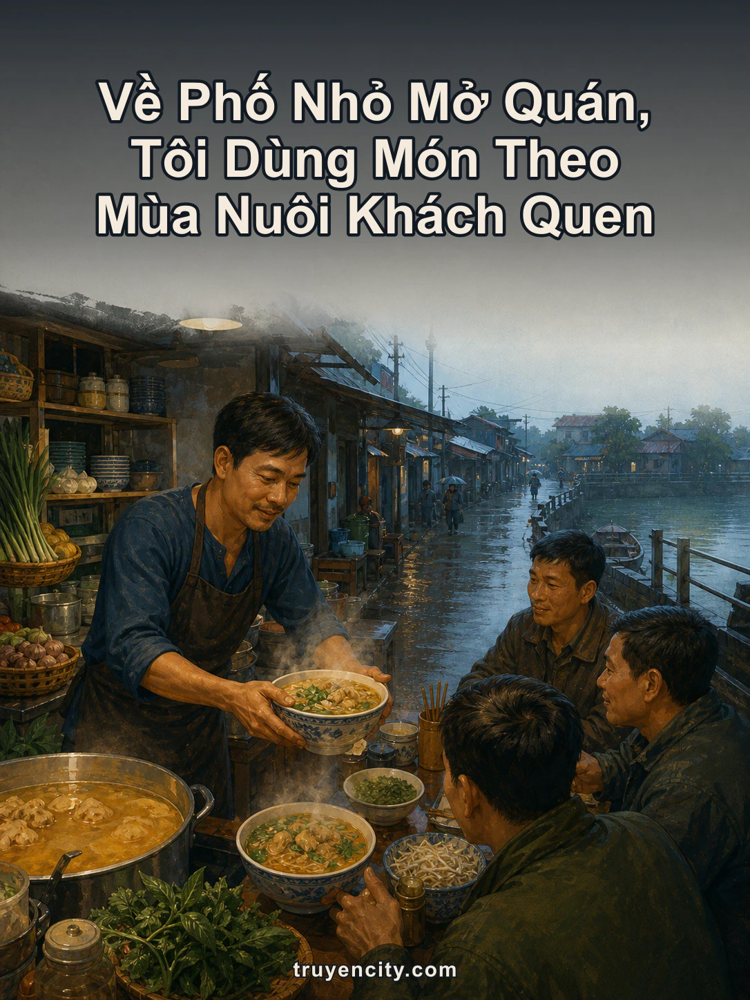

**Tagline:** Khách quen không đến vì món đắt nhất; họ đến vì quán nhớ mình cần gì.

**Mô tả:** Cozy nam tần có progression rõ. Mỗi món phục vụ một nhu cầu thật, bị giới hạn bởi mùa, giá và sức lao động. Đời sống chữa lành nhưng quán, nghề và quan hệ vẫn thay đổi sau từng cửa sổ chương.

**Nhân vật chính:** Tô Lâm, đầu bếp rời nhà hàng lớn sau chấn thương cổ tay, giỏi nhớ khẩu vị nhưng không quen để khách bước vào đời riêng của mình.

**Bối cảnh:** Quán ăn trong con ngõ ven sông hư cấu, có bếp mở, sân nhỏ và nguồn nguyên liệu thay đổi theo mùa nước.

**Mở truyện:** Ngày khai quán không có khách, Lâm dùng phần nguyên liệu sắp hỏng nấu một nồi cháo cho nhóm công nhân mắc mưa, vô tình tạo những khách quen đầu tiên.

**Lời hứa dài kỳ:** Món ăn, khách quen và không gian quán cùng mở rộng; mỗi comfort payoff phải để lại tiền, kỹ năng hoặc quan hệ mới.

## DT-17 — Mỗi Ngày Một Tấn Hy Vọng

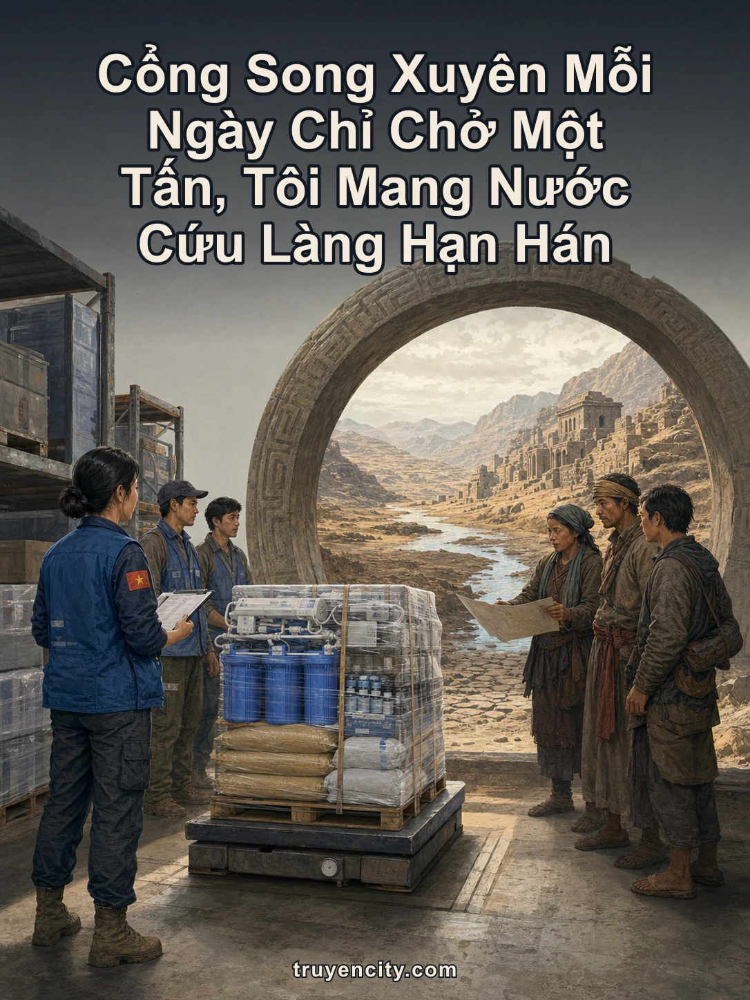

**Tagline:** Cổng chỉ chở được một tấn; cứu ai trước trở thành quyết định không thể trốn.

**Mô tả:** Song xuyên cứu trợ không biến hiện đại thành kho vô hạn. Mọi hàng phải mua, cân và theo dõi; can thiệp làm giá cả, quyền phân phối và nhu cầu hai bên đổi. Payoff là cộng đồng phục hồi năng lực tự sống.

**Nhân vật chính:** Nguyễn Tâm, nhân viên logistics cứu trợ từng ám ảnh vì không thể cứu tất cả, nay phải công khai tiêu chí phân phối để giữ tín nhiệm hai thế giới.

**Bối cảnh:** Một bên là kho cứu trợ tư nhân ở thành phố Việt hư cấu; bên kia là vùng cổ đại khô hạn chia thành nhiều cộng đồng giữ nguồn nước.

**Mở truyện:** Cổng mở lần đầu đúng lúc một làng thiếu nước, nhưng Tâm chỉ chuyển được một tấn và từ chối chở toàn nước đóng chai để dành chỗ cho dụng cụ lọc có tác dụng lâu hơn.

**Lời hứa dài kỳ:** Mỗi chuyến đổi nhu cầu cấp bách, hậu cần và quyền phân phối; giới hạn cổng giữ lựa chọn khó trong khi đời sống vẫn khá lên rõ.

## DT-18 — Qua Mỗi Thế Giới, Học Một Nghề

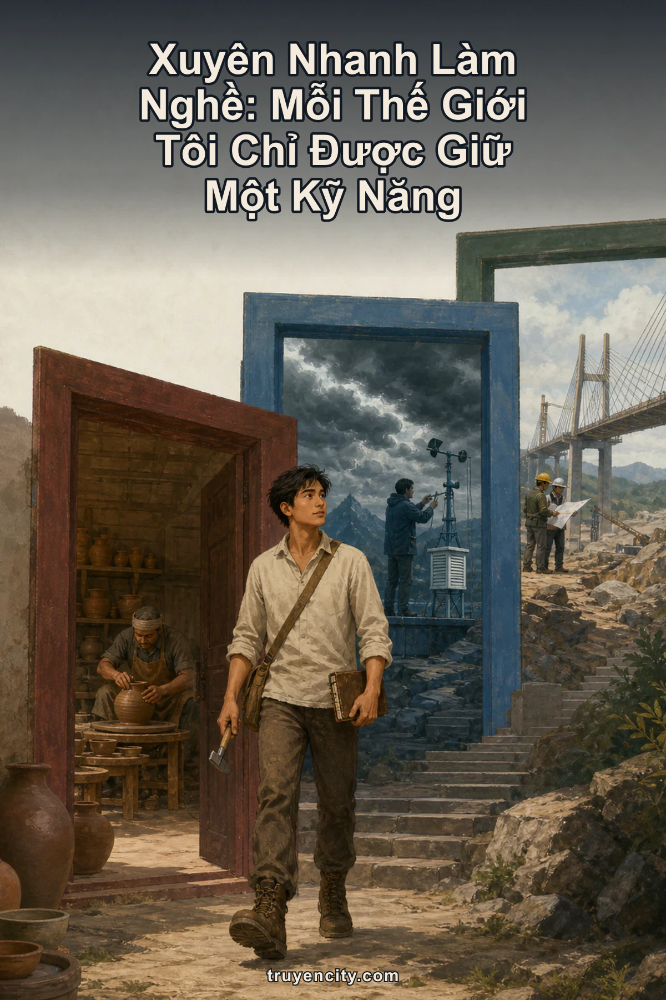

**Tagline:** Anh không mang phần thưởng về; anh mang một kỹ năng và hậu quả của việc đã thay đổi nơi ấy.

**Mô tả:** Khoái xuyên nam tần không farm điểm hệ thống. Mỗi thế giới là bài toán nghề và tổ chức khác, người bản địa có mục tiêu riêng và nơi cũ không reset sạch. Tiến bộ dài hạn là khả năng ra quyết định cùng bản sắc được giữ lại.

**Nhân vật chính:** Lê Bách, người từng đổi quá nhiều việc và không biết mình giỏi gì, bắt đầu giữ một cuốn sổ chỉ ghi những điều người khác đã dạy mình.

**Bối cảnh:** Trạm chuyển tiếp tối giản nối các thế giới nghề nghiệp hư cấu, nơi quyền chọn nhiệm vụ phải được mua bằng ký ức đã giữ.

**Mở truyện:** Nhiệm vụ đầu giao Bách cứu một xưởng gốm trong bảy ngày; khi thành công, anh bỏ kỹ thuật tạo men để mang về cách người thợ cả phân công nhóm.

**Lời hứa dài kỳ:** Mỗi thế giới đổi hoàn toàn nghề, luật và cộng đồng; chỉ một kỹ năng được giữ khiến lựa chọn rời đi luôn có cái giá cảm xúc và chiến lược.
